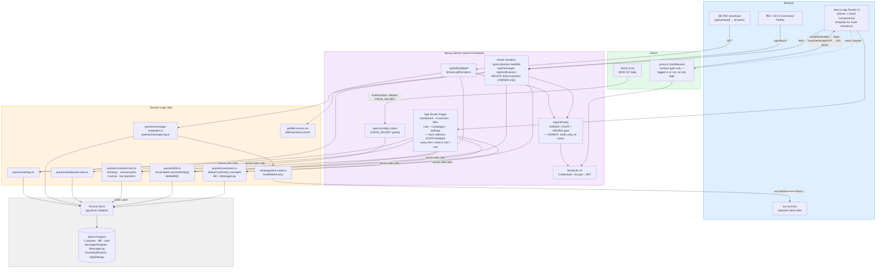
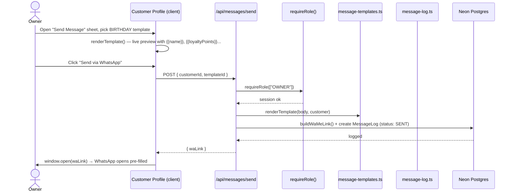
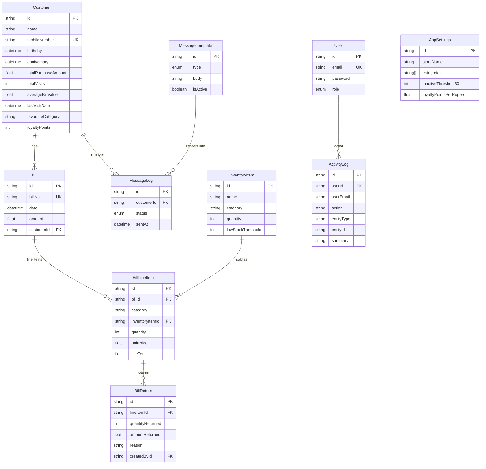

# Kangna Beauty & Jewellery CRM

A CRM for a beauty & jewellery store: customer profiles, visit/billing history with live rollup
stats, automatic segment lists (birthdays, anniversaries, inactive, top spenders), WhatsApp
outreach, per-bill PDF invoices, a dashboard, global search & notifications, and settings — built
with an Apple-HIG inspired UI. Three roles (OWNER / STAFF / VIEWER) control access: VIEWER is
strictly read-only, and deleting a bill or customer is OWNER-only.

**Live:** [kangnafaizabad.vercel.app](https://kangnafaizabad.vercel.app)

## Tech Stack

| Layer | Choice |
|---|---|
| Framework | Next.js 16 (App Router), TypeScript strict |
| Styling | Tailwind CSS v4 + shadcn/ui (base-ui) |
| Database | PostgreSQL (Neon, via Vercel Marketplace) |
| ORM | Prisma 7 (driver-adapter client, `@prisma/adapter-pg`) |
| Auth | NextAuth v5 (Credentials provider, JWT sessions, OWNER/STAFF/VIEWER roles) |
| Messaging | WhatsApp `wa.me` link-mode (Cloud API stubbed, not implemented) |
| Forms | react-hook-form + zod (shared client/server validation) |
| Charts | Recharts |
| PDF | `@react-pdf/renderer` (per-bill invoice download) |
| Motion | framer-motion (`template.tsx` route transitions, list/card stagger) |
| Testing | Playwright Test (`testing/e2e/`, manual-trigger e2e + automatic CI typecheck/lint/build) |
| Hosting | Vercel (Functions + Cron) |

## Architecture



### Request flow (a customer sends a WhatsApp birthday message)



## Core Data Model



`Bill` is a header row over a `BillLineItem[]` "shopping cart" — each line item carries its own
category, optional link to a tracked `InventoryItem`, quantity, and price (unit price × quantity,
or a flat line total). Every `Bill` create/update/delete runs inside a Prisma transaction that
recomputes the owning `Customer`'s rollup fields (`totalPurchaseAmount`, `totalVisits`,
`averageBillValue`, `lastVisitDate`, `favouriteCategory`) from scratch — never incrementally — so
they stay correct regardless of edit/delete/return order; `BillReturn` rows net out of
`totalPurchaseAmount`/`favouriteCategory` but don't touch `Bill.amount` itself, which stays the
original sale total. Loyalty points are earned automatically on sale (`AppSettings.loyaltyPointsPerRupee`)
and clawed back on delete/return, plus support manual adjustment. `ActivityLog` is an OWNER-only
audit trail of customer/bill create/update/delete actions.

## Getting Started

```bash
npm install                 # runs `prisma generate` via postinstall
cp .env.example .env        # fill in DATABASE_URL, NEXTAUTH_SECRET, etc.
npx prisma migrate deploy
npx prisma db seed          # optional: seeds demo customers/templates
npm run dev
```

Open [http://localhost:3000](http://localhost:3000). Required environment variables:

```
DATABASE_URL=              # pooled Postgres connection string
DATABASE_URL_UNPOOLED=     # direct connection, used for migrations
NEXTAUTH_SECRET=
NEXTAUTH_URL=http://localhost:3000
WHATSAPP_MODE=link         # "link" (wa.me) or "api" (Cloud API — not implemented)
CRON_SECRET=                # protects /api/cron/daily-check
```

## Testing

`npx tsc --noEmit` and `npm run lint` run automatically on every push/PR via
`.github/workflows/ci.yml`. The Playwright e2e suite (`testing/e2e/`, `npm run test:e2e`) runs
against a real `npm run dev` instance and the real database — there's no separate test DB for this
app — so it's manual-trigger-only (`.github/workflows/e2e.yml`, run from the GitHub Actions tab),
never automatically on push. See `testing/e2e/README.md` for the data-safety rules the suite
follows (throwaway test users, non-destructive delete-flow checks, cleanup guarantees).

## Deployment

Hosted on Vercel with Postgres provisioned via the Vercel Marketplace (Neon). A daily
`vercel.json` cron job hits `/api/cron/daily-check` to generate owner notifications for
today's birthdays/anniversaries and customers crossing inactivity thresholds.
