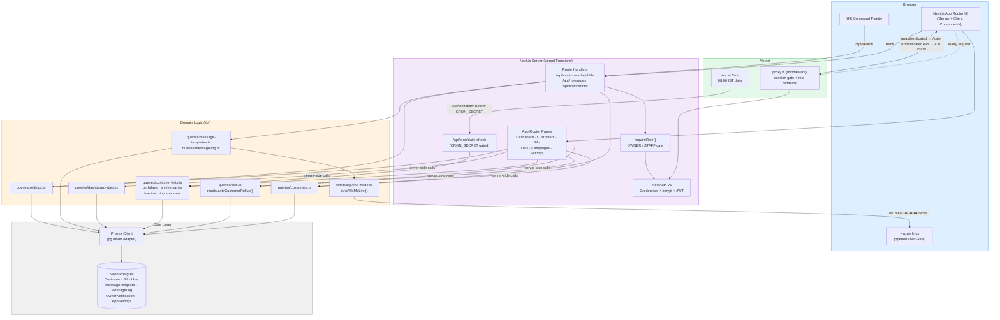
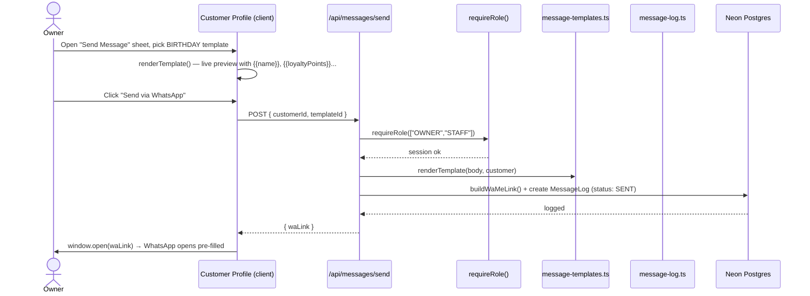
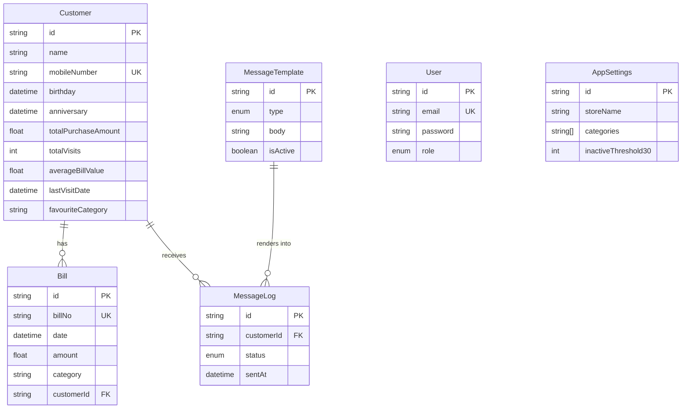

# Kangna Beauty & Jewellery CRM

A CRM for a beauty & jewellery store: customer profiles, visit/billing history with live rollup
stats, automatic segment lists (birthdays, anniversaries, inactive, top spenders), WhatsApp
outreach, a dashboard, global search & notifications, and settings — built with an Apple-HIG
inspired UI.

**Live:** [kangana-crm.vercel.app](https://kangana-crm.vercel.app)

## Tech Stack

| Layer | Choice |
|---|---|
| Framework | Next.js 16 (App Router), TypeScript strict |
| Styling | Tailwind CSS v4 + shadcn/ui (base-ui) |
| Database | PostgreSQL (Neon, via Vercel Marketplace) |
| ORM | Prisma 7 (driver-adapter client, `@prisma/adapter-pg`) |
| Auth | NextAuth v5 (Credentials provider, JWT sessions, OWNER/STAFF roles) |
| Messaging | WhatsApp `wa.me` link-mode (Cloud API stubbed, not implemented) |
| Forms | react-hook-form + zod (shared client/server validation) |
| Charts | Recharts |
| Motion | framer-motion |
| Hosting | Vercel (Functions + Cron) |

## Architecture



### Request flow (a customer sends a WhatsApp birthday message)



## Core Data Model



Every `Bill` create/update/delete runs inside a Prisma transaction that recomputes the owning
`Customer`'s rollup fields (`totalPurchaseAmount`, `totalVisits`, `averageBillValue`,
`lastVisitDate`, `favouriteCategory`) from scratch — never incrementally — so they stay correct
regardless of edit/delete order.

## Getting Started

```bash
npm install                 # runs `prisma generate` via postinstall
cp .env.example .env        # fill in DATABASE_URL, NEXTAUTH_SECRET, etc.
npx prisma migrate deploy
npx prisma db seed          # optional: seeds demo customers/templates
npm run dev
```

Open [http://localhost:3000](http://localhost:3000). Required environment variables:

```
DATABASE_URL=              # pooled Postgres connection string
DATABASE_URL_UNPOOLED=     # direct connection, used for migrations
NEXTAUTH_SECRET=
NEXTAUTH_URL=http://localhost:3000
WHATSAPP_MODE=link         # "link" (wa.me) or "api" (Cloud API — not implemented)
CRON_SECRET=                # protects /api/cron/daily-check
```

## Deployment

Hosted on Vercel with Postgres provisioned via the Vercel Marketplace (Neon). A daily
`vercel.json` cron job hits `/api/cron/daily-check` to generate owner notifications for
today's birthdays/anniversaries and customers crossing inactivity thresholds.
